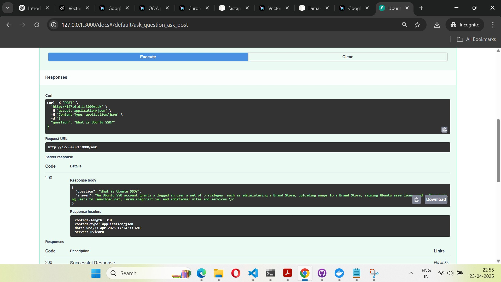
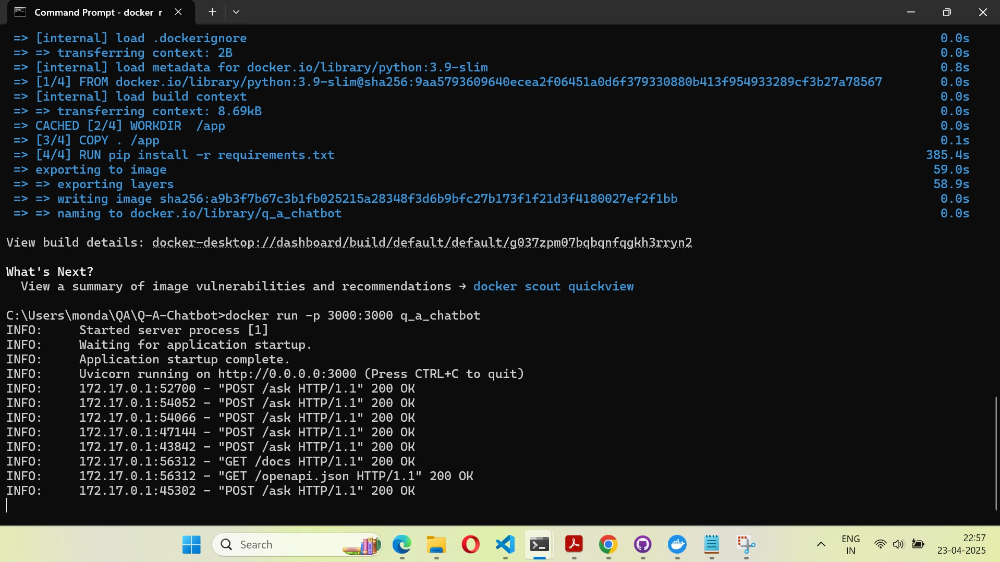

# 🤖 Ubuntu Documentation Chatbot

A smart chatbot powered by LLMs (Google Gemini 2.0) and vector search (ChromaDB + HuggingFace Embeddings) that can answer queries about Ubuntu documentation in Markdown format.

---

## 📌 Features

- 🔍 Vector search powered by `ChromaDB`
- 🧠 OS-level embeddings using `BAAI/bge-base-en-v1.5`
- 💬 Query interface via FastAPI
- 📦 Dockerized for easy deployment
- 🧪 Test via Swagger UI or curl
- 🚀 Uses Google Gemini 2.0 Flash as LLM (or pluggable OpenAI)

---

## 🧱 Project Structure

```
q_a_chatbot/
├── demo_bot_data/             # Markdown documents
├── chroma_db/                 # Chroma vector store (persistent)
├── app.py                     # FastAPI app
├── chatbot.py                 # Standalone query runner
├── vector_store_setup.py      # Create vector store
├── requirements.txt
├── Dockerfile
└── README.md
```

---

## ⚙️ Setup Instructions

### 🔹 1. Clone the Repository

```bash
git clone https://github.com/mondaldebojit21/Q-A-Chatbot.git
cd Q-A-Chatbot
```

### 🔹 2. Create a Virtual Environment

```bash
python -m venv venv
source venv/bin/activate   # On Windows: venv\Scripts\activate
pip install -r requirements.txt
```
### 🔹 3. Set the Google API Key

To use the Gemini model, set your `GOOGLE_API_KEY`.

#### Option A: Set it in Python (Quick Test)
```python
import os
os.environ["GOOGLE_API_KEY"] = "your-api-key-here"
```

#### Option B: Set it in the Terminal (Recommended)

**Linux/macOS:**
```bash
export GOOGLE_API_KEY="your-api-key-here"
```

**Windows CMD:**
```cmd
set GOOGLE_API_KEY=your-api-key-here
```

**Windows PowerShell:**
```powershell
$env:GOOGLE_API_KEY="your-api-key-here"
```

### 🔹 4. Create the Vector Store

```bash
python vector_store_setup.py
```

---

## 💬 Running the Chatbot

### 🔸 Option A: Run via FastAPI (Local Dev)

```bash
python app.py
```

Visit: [http://127.0.0.1:3000/docs](http://127.0.0.1:3000/docs)

---

### 🔸 Option B: Run with Docker

```bash
docker build -t q_a_chatbot .
docker run -p 3000:3000 -v ${PWD}/chroma_db:/app/chroma_db q_a_chatbot
```

Then go to [http://localhost:3000/docs](http://localhost:3000/docs)

---

## 📥 Sample Query (cURL)

```bash
curl -X POST http://127.0.0.1:3000/ask \
 -H "Content-Type: application/json" \
 -d "{\"question\": \"What is Ubuntu SSO?\"}"
```

---

## 🖼️ Screenshots

### Swagger UI - API Interface




---
